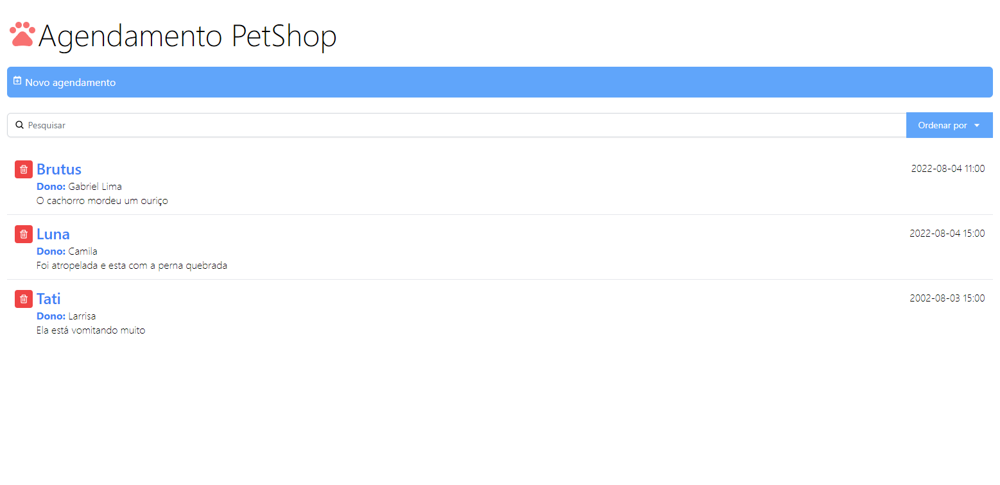

# 🐕 Petshop Agendamento

<h1 align="center">
  
</h1>

<h4 align="center"><a href="https://gabriellimmaa.github.io/petshop-agendamento/">Clique para visitar o site</a></h4>

---

## 📚 Seções

O site contém as seguintes seções:
- **Home:** Tela de início com todos os agendamentos;
- **Novo agendamento:** Registra um novo agendamento ao petshop;
- **Pesquisa:** Consegue pesquisar e ordenar os agendamentos;

---

## 🛠️ Desenvolvido com

Para o desenvolvimento deste site eu usei as seguintes tecnologias:
- React;
- Craco;
- React-Icons;
- TailwindCSS;

---

## ⚙️ Descrição

Este projeto foi desenvolvido conforme o curso `React.js: Building an Interface de Ray Villalobos` no Linkedin Learning.

---

## ✒️ Autor

<table>
  <tr>
    <td align="center">
      <a href="https://github.com/Gabriellimmaa">
         
        
          <b>Gabriel Lima</b>
        
      </a>
    </td>
  </tr>
</table>

---

Obrigado por me ceder seu tempo lendo sobre o meu trabalho.

Qualquer dúvida, crítica ou sugestão entre em, <a href="mailto:gabriellimamoraes@gmail.com/">contato</a> pelo meu e-mail
